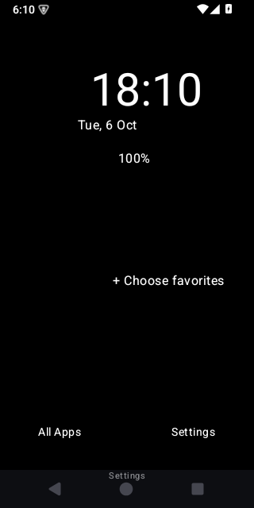
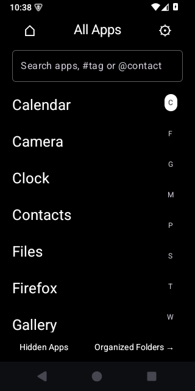
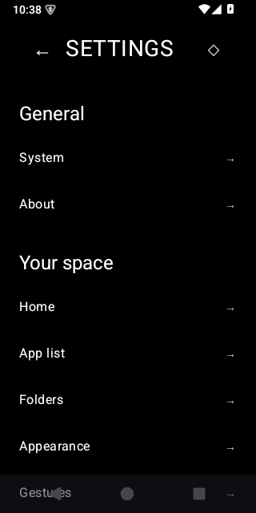

# EmmanueLA


A minimalist Android launcher for intentional phone use. Local settings, deliberate search, organized folders and optional focus rules. This project continues the existing v2.6 application and preserves its identity and data format.

**Version:** 2.6.0-beta · **Android:** 8.0/API26 or newer · **License:** MIT

## What it does

- Independent Home, App List and folders, with an optional Home alphabet and configurable gestures.
- Ranked app/alias search, tags (`#`), permission-based contacts (`@`), explicit web searches (`/query`), protected folder results and opt-in searchable actions. Actions require a tap and use the same authorization checks as ordinary launches.
- Password/device-protected folders, manual ordering and built-in clock/date/battery/usage/weather/location widgets. Placement is saved on completed gestures; cancelled movement is discarded.
- **Live the Moment:** grouped limits, schedules, continuous Strict Block, controlled Breaks, warnings/grace and optional intention prompts. These are self-management tools, not tamper-proof parental controls.
- Optional notification dismissal/digest with schedules, keywords, Strict Block scope and temporary suppression. Calls, alarms, ongoing and media notifications are preserved. Android channel settings control quiet delivery; a listener cannot undo an alert already played.

## Honest platform limits

Launcher entry checks and optional accessibility enforcement have different boundaries. Apps can still be opened through other Android surfaces when accessibility enforcement is disabled or restricted. Private Space protects launcher entry points; it does not encrypt or isolate other apps.

Website blocking is **best-effort visible-address matching**, not a VPN. **Firefox157's tested normal-mode address source is UNSUPPORTED**; the app displays an unreadable-address diagnostic instead of falsely claiming a block. Other browser adapters are not runtime-verified. See the [browser/mode evidence](docs/BROWSER_COMPATIBILITY.md). Selective native Shorts/Reels/feed filtering is unsupported.

## Privacy

No accounts, ads or analytics. Configuration and focus rules stay on the device. Optional contact search and notification keyword matching run locally; message bodies, intentions and browser history are not persisted. Optional weather sends selected coordinates/location queries to Open-Meteo. Android backup is disabled; explicit exports omit nonportable grants and temporary access state. See [permissions and privacy](docs/PRIVACY.md).

## Install and build

For beta testing, open **Actions → Validate EmmanueLA → a successful main-branch run → Artifacts → EmmanueLA-APK**. Extract the ZIP and install **EmmanueLA.apk**. It is the R8-minified, resource-shrunk release APK, signed with a dedicated beta key and checked for signature, non-debuggable status and API35 emulator installation. Both existing validation jobs must pass before signing. No GitHub Release or Google Play publication is created.

The beta signing identity must remain stable for updates. An existing installation signed with a different key cannot be updated in place; export any needed launcher configuration before choosing to uninstall it. Physical-device compatibility is not certified by emulator checks. Maintainer setup and signing boundaries are in [beta APK signing](docs/BETA_APK.md). The separate `EmmanueLA-builds` artifact still contains development/unsigned build outputs.

Open this repository directory in Android Studio, using JDK17 and Android SDK35. The wrapper uses Gradle8.11.1, AGP8.9.2 and Kotlin2.1.20.

```sh
./gradlew clean :app:testDebugUnitTest :app:lintDebug :app:assembleDebug
./gradlew :app:assembleRelease :app:bundleRelease
./gradlew :app:connectedDebugAndroidTest
```

On Windows use `gradlew.bat`. Outputs are under `app/build/outputs/`. Select EmmanueLA in Android's default Home settings after installing. Sensitive permissions are optional and requested for the corresponding feature.

## Validation and roadmap

**BETA READY for controlled testing.** Final clean validation of code checkpoint `056f629` passed **123 JVM tests and all 18 API35 emulator tests**, lint (0 errors, 43 warnings), debug/release APK and release AAB builds. A locally development-signed copy of the minified release passed runtime smoke checks. No production release was published.

See the [final engineering report](docs/FINAL_REPORT.md), [current validation](docs/VALIDATION.md), [engineering evidence](docs/ENGINEERING_VALIDATION.md), [performance and size measurements](docs/PERFORMANCE.md), and [search behavior](docs/SEARCH.md). The universal release APK is 2,789,120 bytes, down 8.2% from the measured M6 baseline. Emulator search measurements improved; physical frame-rate and battery performance are not certified.

### Release screenshots

Actual API35 emulator captures of the minified release:

| Home | App List | Settings |
|---|---|---|
|  |  |  |

Contributions should preserve the existing design and data. Start with [CONTRIBUTING](CONTRIBUTING.md), use the issue templates for reproducible problems, and read [SECURITY](SECURITY.md). Remaining acceptance requires physical devices/OEMs, biometrics, haptics, battery and high-refresh displays. Remote CI and production signing/publication remain unexecuted. Earlier delivery notes are preserved in [history](docs/history/README-delivered.md).

Licensed under [MIT](LICENSE). The logo above reproduces the application's existing vector icon.
